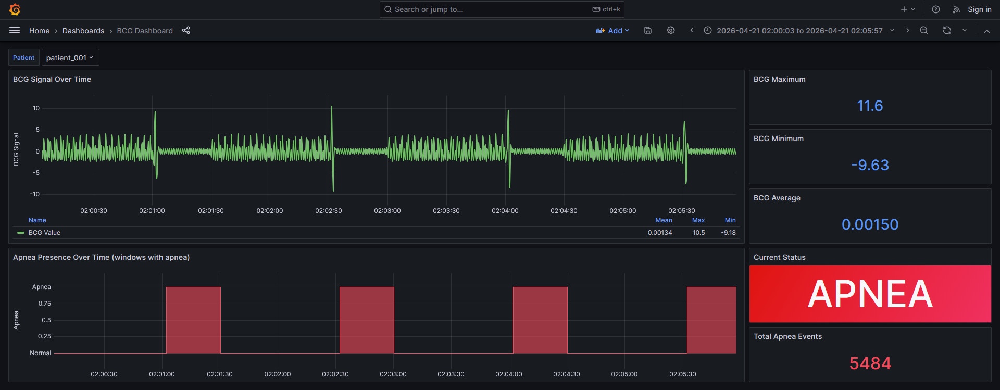
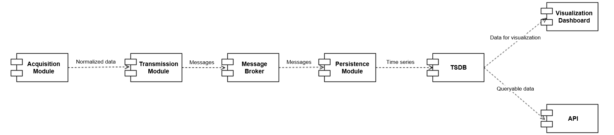
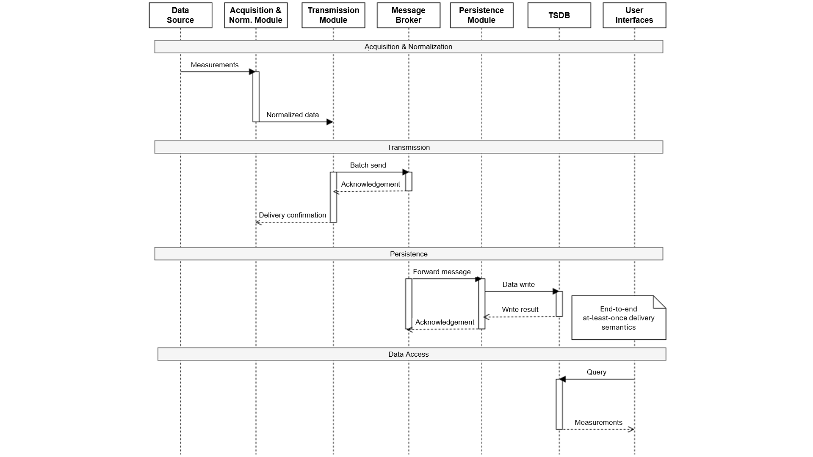

# Distributed IoT Architecture for Remote Monitoring of Physiological Parameters

[](https://www.python.org/)
[](https://www.docker.com/)
[](https://mosquitto.org/)
[](https://www.influxdata.com/)
[](https://fastapi.tiangolo.com/)
[](https://grafana.com/)

**High-performance distributed IoT architecture (11k data points/s) with a zero data loss guarantee for Remote Patient Monitoring (RPM) scenarios. A scalable and modular system applying advanced design patterns to a modern stack (FastAPI, MQTT, InfluxDB, Docker).**


*Figure 1: Near real-time telemetry dashboard visualizing high-frequency BCG signals and automated apnea event detection.*

## Key Experimental Results

Validation was conducted by streaming real BCG traces through dedicated mocks. Stress tests on over **2 million measurements** confirmed the system's high-frequency stability, while the modular design ensures architectural generalizability across heterogeneous sources (as demonstrated by the [Smart Ring integration](#1-proof-of-concept-architecture-extensibility-smart-ring)).

| Metric | Value |
|:---|---:|
| Publisher Throughput | ~ 11,000 dp/s |
| Bridge Throughput (persistence) | ~ 11,000 dp/s |
| End-to-end Data Loss | **0%** |
| Transmission Retries | 0 |
| Persistence Retries | 0 |
| Processing Time for 2M Measurements | ~ 3 minutes |

The system withstood all tested failure scenarios: MQTT broker disconnection, prolonged InfluxDB unavailability, malformed incoming data, and forced shutdown via SIGTERM.

## Project Context & Origins

This system was originally developed as a **Bachelor's Thesis in Electronic and Computer Engineering** at the *University of Campania "Luigi Vanvitelli"*.

Despite its academic nature, the project was conceived with an **industry-ready** approach, focusing on advanced design patterns and enterprise-level reliability.

| | |
| :--- | :--- |
| **Candidate** | Paolo Benitez Paccha |
| **Supervisor** | Prof. Salvatore Venticinque |
| **Co-supervisor** | Ing. Palma Errico |
| **A.Y.** | 2024/2025 |

> **[Official Thesis Document (Italian)](docs/bachelor-thesis-italian.pdf)** - *The codebase includes minor post-thesis improvements documented in the [Notes on Project Evolution](#notes-on-project-evolution-post-thesis) section.*

## Table of Contents

- [Key Experimental Results](#key-experimental-results)
- [Project Context & Origins](#project-context--origins)
- [Technical Overview](#technical-overview)
- [Technology Stack](#technology-stack)
- [System Architecture](#system-architecture)
  - [Data Acquisition & Extensibility](#data-acquisition--extensibility)
  - [Data Modeling & Contracts](#data-modeling--contracts)
  - [Delivery Semantics and Reliability](#delivery-semantics-and-reliability)
- [Repository Structure](#repository-structure)
- [Quick Start](#quick-start)
- [REST API](#rest-api)
- [Security Analysis and Future Roadmap](#security-analysis-and-future-roadmap)
- [Notes on Project Evolution (post-thesis)](#notes-on-project-evolution-post-thesis)
  - [1. Proof of Concept: Architecture Extensibility (Smart Ring)](#1-proof-of-concept-architecture-extensibility-smart-ring)
  - [2. Global Configuration Refactoring and Validation Strategy (Pydantic)](#2-global-configuration-refactoring-and-validation-strategy-pydantic)
  - [3. InfluxDB Schema Refactoring](#3-influxdb-schema-refactoring)
  - [4. Dynamic Sensor Registration (Registry Pattern)](#4-dynamic-sensor-registration-registry-pattern)
- [License](#license)

## Technical Overview

Remote monitoring of physiological parameters requires the continuous collection of data streams from **heterogeneous sources**, often at **high frequency** and operating over **unreliable networks**. Traditional synchronous systems (client-server) struggle to scale and to guarantee **data integrity** in these scenarios.

This project addresses these challenges by implementing a **robust, distributed software architecture** that covers the entire data lifecycle. Leveraging an **asynchronous pipeline model**, it ensures the collection, processing, and delivery of clinical time series (e.g., **BCG signals** and **apnea events**), achieving **zero data loss** even during severe network disconnections.

## Technology Stack

Each technology was selected for a precise architectural role; no tool is redundant.

- **MQTT / Mosquitto:** OASIS standard messaging protocol for resource-constrained devices. Used at QoS level 1 (at-least-once), which represents the optimal trade-off between logical reliability and network overhead for this scenario. Batches are serialized with **MessagePack**, a binary format that reduces payload size by 30-50% compared to JSON.

- **InfluxDB:** Time Series Database (TSDB) natively optimized for continuous high-frequency temporal streams. Selected for its write performance, native support for time-window aggregations, and duplicate handling via overwrite, consistent with the at-least-once semantics adopted.

- **Grafana:** Visualization platform natively integrated with InfluxDB, capable of delivering interactive near-real-time dashboards with limited resource overhead.

- **FastAPI:** Asynchronous Python framework that implements the abstraction layer between clients and the database. Supports asynchronous programming for handling concurrent requests without blocking I/O operations, and automatically generates OpenAPI/Swagger documentation.

- **Docker & Docker Compose:** Each system component runs in an isolated container with its own dependencies. The entire stack can be started with a single command, reducing deployment to a reproducible and portable operation on any environment.

- **Python:** The glue language between pipeline components. Adopted for its versatility in handling network protocols, heterogeneous data formats, and time series libraries, with an object-oriented approach that promotes modularity.

## System Architecture

The architecture adopts a **pipeline model** based on independent components that communicate **asynchronously** following the *publish-subscribe* paradigm. This approach eliminates direct dependencies between modules, promotes horizontal scalability, and allows the system to evolve with minimal impact on existing components.

The data flow begins at the edge: measurements are acquired from local sources, normalized into a common format, transmitted to a central hub, and finally routed to the persistence module to be made available for visual or programmatic consumption.


*Figure 2: System Architecture and Data Flow Between Components*

### Data Acquisition & Extensibility

In this implementation, the acquisition module acts as a file-based gateway. To validate the system with realistic clinical workloads, physical sensors are replaced by mocks that poll a local directory for CSV files containing pre-recorded traces.

The system is designed to integrate new sensor types with minimal effort via the Template Method Pattern, encapsulated in the `BaseDataSource` abstract class. To add a new data source, a developer only needs to define a subclass with three specific elements:

- **Hardware Registration:** Apply the `@register_datasource("unique_type")` decorator to automatically integrate the sensor into the orchestrator's discovery loop.
- **Schema Definition:** Declare the mandatory CSV columns (`REQUIRED_COLUMNS`). The base class uses this declarative contract to automatically act as a gatekeeper, rejecting malformed files (fail-fast) without requiring any custom validation code from the developer.
- Implement a pure transformation function (`_map_rows`) that converts the raw, pre-validated CSV rows into standardized `MappedRow` objects.

The base class automatically handles the heavy lifting: directory polling, file lifecycle management, validation, and coordination with the transmission layer.

### Data Modeling & Contracts

The pipeline enforces explicit data contracts to decouple the raw acquisition logic from the transmission requirements:

* **MappedRow (The Logic Contract):** This is the internal DTO returned by sensor-specific subclasses. It represents the first level of abstraction: the subclass handles the "dirty" work (like parsing CSV offsets into absolute UTC timestamps or extracting patient IDs from filenames) and packs them into this structured container.

* **DataPoint (The Transport DTO):** This is the finalized, system-wide contract. The `BaseDataSource` acts as a Gatekeeper: it iterates over `MappedRow` objects, performs final sanitization (e.g., stripping `None` values which are illegal in InfluxDB, forcing string types on tags), and produces a `DataPoint`. This object is optimized for MessagePack serialization with shortened keys (`ts`, `m`, `dt`, `di`) to minimize network overhead.

### Delivery Semantics and Reliability

The core strength of the system is its robustness: each component signals successful processing only after the next stage has confirmed reception. This creates a chain that implements a solid **at-least-once delivery semantic**.


*Figure 3: End-to-End Data Flow Sequence Diagram*

#### Publisher - Transmission Guarantees

- **Confirmed Archiving:** A CSV file is moved to `processed/` only after the MQTT broker has acknowledged every batch extracted from it with a PUBACK. No data leaves the edge node without confirmation.
- **Resilience to Outages:** On disconnection, the Publisher suspends the flow and waits for session restoration. It uses **Exponential Backoff with Jitter** for retries to prevent synchronization storms during reconnection.
- **Dead Letter Queue:** Files that fail validation or remain unconfirmed are moved to `failed/` for manual clinical review, preventing corrupted data from entering an infinite retry loop.

#### Bridge - Persistence Guarantees

- **Strict Consistency:** The Bridge avoids volatile in-memory queues. The MQTT thread loop performs synchronous writes to InfluxDB and sends the ACK to the broker only after the data is physically committed to the disk.
- **Natural TCP Backpressure:** Because the Bridge blocks on database writes, it naturally throttles the MQTT broker's delivery via TCP buffer saturation. This prevents Out-Of-Memory (OOM) crashes during high-load spikes without complex rate-limiting logic.
- **Idempotency:** Any duplicate messages caused by the at-least-once semantics are handled natively by InfluxDB via its default overwrite policy for identical timestamps and tags.

#### System-Level Self-Healing

- **Graceful Shutdown and Orchestrator Recovery:** If the exponential backoff retries are completely exhausted (e.g., during a severe and prolonged network or database outage), both the Publisher and Bridge do not hang indefinitely. Instead, they initiate a graceful shutdown. This intentional exit safely halts the data extraction and processing loops, guaranteeing zero data loss. The system then delegates the recovery to Docker's restart policies, ensuring the services are automatically revived in a clean state once the infrastructure stabilizes.

## Repository Structure

```
.
├── config/             # Automatic provisioning and configuration (MQTT, Grafana, InfluxDB)
├── data/               # Dataset management (Pipeline: inbox -> processed/failed)
├── docs/               # Official documentation (PDF of the Bachelor's Thesis)
├── services/           # Dockerfile and entry-points for services (API, Bridge, Publisher)
├── src/                # Core logic and design pattern implementations
│   ├── core/           # Data Transfer Object (DataPoint)
│   ├── datasources/    # BaseDataSource hierarchy (Template Method Pattern)
│   ├── publisher/      # Batch serialization and transmission (MQTTPublisher)
│   ├── bridge/         # Bridge processing logic (MQTTInfluxBridge)
│   └── config/         # Centralized configuration via environment variables
├── tests/              # API test suite
├── .env.example        # Example of required environment variables
├── .gitignore          # Exclusion of unnecessary files from version control
└── docker-compose.yml  # Full infrastructure orchestration
```

## Quick Start

### Prerequisites

- Docker Compose V2
- Git

### Running the Stack

```bash
# 1. Clone the repository
git clone https://github.com/pabslab/health-monitoring.git
cd health-monitoring

# 2. Configure the environment
cp .env.example .env

# 3. Start the full stack
docker compose up --build
```

| Service | URL |
|:---|:---|
| InfluxDB UI | http://localhost:8086 |
| Grafana (Dashboard) | http://localhost:3000 |
| FastAPI (Swagger UI) | http://localhost:8000/docs |

> **Note:**  
> * If data does not appear in the dashboard, set the time range to **Last 24 hours**.  
> * InfluxDB credentials are configurable via `.env` (see `.env.example`).

## REST API

The interface exposes four endpoints, automatically documented via OpenAPI/Swagger:

| Endpoint | Method | Description |
|:---|:---|:---|
| `/health` | GET | API + InfluxDB health check |
| `/data/bcg` | GET | Raw data extraction with patient filter and limit |
| `/stats/bcg` | GET | Aggregate statistics (mean, std dev, min, max, apnea events) |
| `/predict/patient-status` | POST | Heuristic inference on subject status (signal variance) |

## Security Analysis and Future Roadmap

While the current architecture successfully implements a robust data ingestion pipeline, transitioning from an academic proof of concept to a production-ready healthcare system requires addressing specific security boundaries. The following mitigation roadmap has been identified following a *Defense in Depth* analysis.

### High Priority - Network Security and Transport

- **Enable MQTTS (TLS):** Current MQTT communication operates over standard TCP (port 1883). Implementing TLS (port 8883) with CA certificates is critical to encrypt biometric payloads in transit and prevent network sniffing.
- **Broker Authentication:** Implement client credentials (username/password or mutual TLS client certificates) to prevent unauthorized publishing or subscription (broker spoofing).
- **Secure Persistence:** Ensure the InfluxDB connection uses HTTPS so that the authentication token is not transmitted in plaintext over the internal network.

### Medium Priority - Node Resilience

- **Local File Security:** Implement strict filesystem permissions (`chmod`/`chown`) on the `inbox/` directory to prevent CSV injection from unauthorized local processes.
- **Resource Exhaustion Protection:** Introduce file size limits before Pandas extraction to prevent local memory exhaustion via oversized input files (DoS via "CSV bombs").

### Low Priority - Data Semantic Integrity

The system currently validates structural integrity (discarding `None` values and empty strings to protect the InfluxDB Write API). Future iterations could extend this with semantic validation (e.g., rejecting physiologically impossible values such as 9999 bpm) or digital payload signatures to ensure data non-repudiation.

## Notes on Project Evolution (post-thesis)

The code in this repository includes some updates and proof-of-concept (PoC) implementations developed after the official thesis document (located in the `docs/` folder) was written.

### 1. Proof of Concept: Architecture Extensibility (Smart Ring)

- **At runtime:** When the infrastructure starts, the Publisher service automatically instantiates a dedicated thread for Smart Ring data acquisition, running in parallel with the BCG thread.
- **In InfluxDB:** By exploring the InfluxDB UI (port 8086), both `bcg_ward_simulator` measurements and `colmi_r02_ring` data (accelerometer, PPG, etc.) will be present.
- **Time range for Smart Ring data:** Set the InfluxDB time selector to **December 2025** (Custom Time Range), as the provided test traces were recorded during that period.

> **Note:** This integration serves exclusively as field validation of the transport pipeline (MQTT) and persistence layer (Bridge). Grafana dashboards and FastAPI endpoints remain focused on the BCG dataset only.

### 2. Global Configuration Refactoring and Validation Strategy (Pydantic)

Although the official thesis documentation references the use of `os.getenv` for configuration, the codebase has been significantly upgraded to implement Pydantic Settings across the entire infrastructure (API, Publisher, and Bridge).

By centralizing the configuration in a dedicated `settings.py` module, the system now guarantees:

- **Global Strict Validation:** The system strictly validates data types (e.g., `int` for MQTT/Influx ports) and the mandatory presence of all required keys in the `.env` file for every service.
- **Fail-Fast Pattern:** If any configuration is invalid or missing, the application immediately halts startup across all containers, entirely preventing silent runtime errors or zombie processes.
- **Encapsulation:** Configuration logic is isolated, making the core service code cleaner and easier to maintain.

***Why Not Everywhere? - Performance-Aware Design Choice***

While Pydantic is exceptionally powerful for configuration and API payload validation, it was intentionally excluded from the high-frequency data processing loops (such as the instantiation of `DataPoint` or `MappedRow` objects).

Applying Pydantic's heavy validation overhead to individual measurements in a pipeline processing ~10,000 data points per second would severely degrade system throughput and destroy performance. Instead, data integrity within the pipeline is robustly guaranteed through highly optimized, low-overhead techniques:

- **Vectorized Validation:** Utilizing Pandas' underlying C-optimizations (e.g., `pd.to_numeric` with coercion) to clean and drop malformed rows in bulk.
- **Gatekeeper Pattern:** The `BaseDataSource` orchestrates structural checks and enforces type constraints (e.g., stripping `None` values, forcing string conversions on tags) right before the data hits the transport layer.

> **Note on DataFrame Validation (Pandera):** While dedicated libraries like Pandera exist for Pandas schema validation and could theoretically replace the manual cleaning steps, they were deliberately excluded. Introducing Pandera would add unnecessary abstraction overhead to a data sanitization logic (`_coerce_and_clean`) that is already clean, native, and perfectly tailored to the system's performance constraints.

### 3. InfluxDB Schema Refactoring

In the original work of thesis, the measurement coincides with the `device_type` (e.g., `bcg_ward_simulator`). Analyzing the system in hindsight, this was identified as a code smell: it couples the physical layer (the device) to the logical storage layer, making it difficult to add new types of sensors without a proliferation of measurements. 

A more scalable schema has been implemented separating responsibilities explicitly:

| Level | Current Value | Proposed Value | Responsibility |
|:---|:---|:---|:---|
| Bucket | `sensors` | `sensors` | The database (unchanged) |
| Measurement | `bcg_ward_simulator`, `colmi_r02_ring` | `biometrics` | The data domain |
| Tag `device_type` | `bcg_ward_simulator`, `colmi_r02_ring` | `bcg_ward_simulator`, `colmi_r02_ring` | Hardware class (unchanged) |
| Tag `device_id` | `bcg_ward_simulator_01`, `colmi_r02_ring_01` | `SIM-EDGE-GATEWAY-01`, `MOCK-MAC-A1:B2:C3:D4:E5:F6` | Unique identity |

This approach enables more expressive queries and a scalable organization.

### 4. Dynamic Sensor Registration (Registry Pattern)

To further adhere to the **Open/Closed Principle (OCP)**, the orchestration layer has been refactored to eliminate hardcoded dependencies between the Publisher Application class and specific `DataSource` implementations.

- **Decoupled Discovery:** The system now utilizes a Registry Pattern. A centralized registry maintains a mapping of sensor type strings to their respective Python classes.
- **Decorator-based Registration:** New sensors are automatically discovered and registered at import-time using a custom `@register_datasource("sensor_type")` decorator.
- **Zero-touch Orchestration:** Adding a new sensor type (e.g., a new wearable or physiological device) no longer requires modifying the core orchestration logic; simply creating a new decorated subclass in the `datasources/` package is sufficient for the system to support it.

This implementation effectively separates the Policy (how the system runs and scales) from the Mechanism (how specific data is extracted), significantly lowering the maintenance burden as the number of supported devices grows.

## License

This project is licensed under the **PolyForm Noncommercial License 1.0.0**.
- **Free for:** Personal use, academic research, and non-commercial organizations.
- **Commercial use:** Requires a separate commercial license. 
Please contact me if you are interested in using this technology for business purposes.